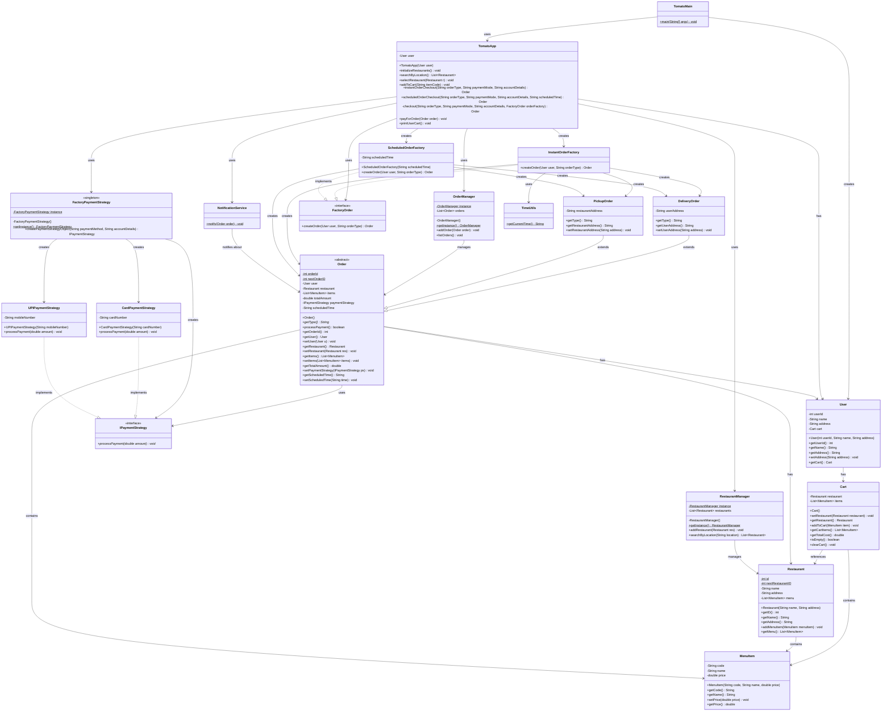

# V01_MyDesign - Tomato Food Delivery App

## Overview
Initial implementation of a food delivery application similar to Zomato, demonstrating core OOP principles and design patterns.

## Architecture
- **TomatoMain**: Client class that interacts with the application
- **TomatoApp**: Orchestration class (Facade pattern) that coordinates the flow of all functionalities
- **Manager Classes**: Singleton managers for restaurant and order data management
- **Factory Pattern**: Used for creating payment strategies and orders
- **Strategy Pattern**: Used for payment processing

## UML Class Diagram

## Key Features
- User can search for restaurants by location
- Shopping cart functionality with item management
- Support for both instant and scheduled orders
- Multiple order types: Delivery and Pickup
- Multiple payment strategies: UPI and Card
- Order notification system
- Centralized restaurant and order management
